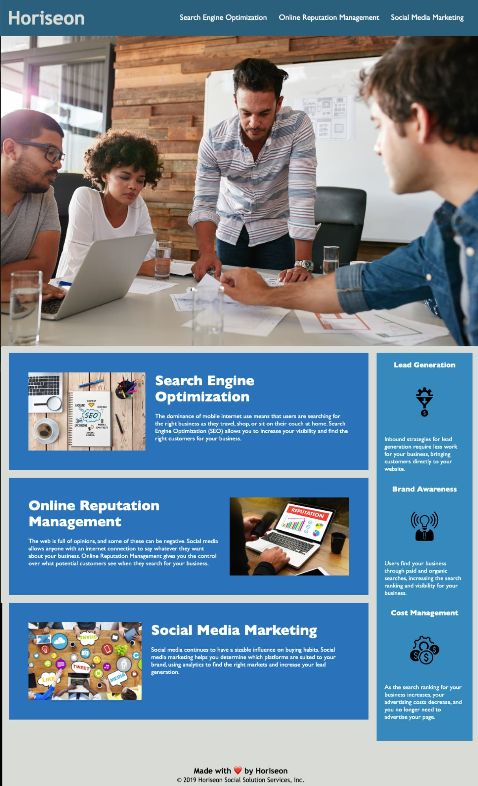

# CP Horiseon Refactoring Challenge 01

## Description

Developed a codebase that follows accessibility standards to ensure that it is accessible by all and optimized for search engines. Existing code was refactored and simplified, particularly to remove repetitive code. 

- Goal of the code update was to improve accessibilty and search engine optimization 
- Apply semantic HTML elements to organize code and improve accessibility
- Compressed large images in order to improve load times and reduce size of site 
- Improved understanding of semantic code elements and how to reduce code size by applying the "Don't Repeat Yourself" (DRY) method

## Usage

File can be downloaded and used to gain inside into refactoring code and applying accessibility standards. 

## Credits

Horiseon Original Source Code

## License

- GitHub repository URL: https://github.com/cherah-petra/CP-Horiseon-Refactoring-Challenge-01
- License: license.txt

